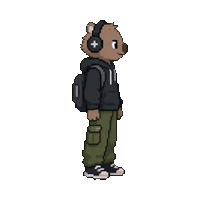
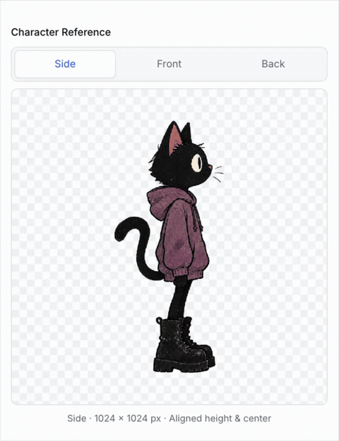
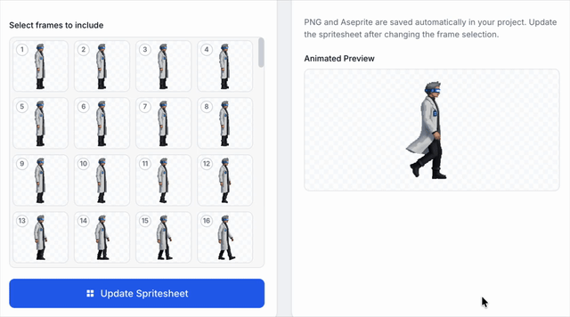
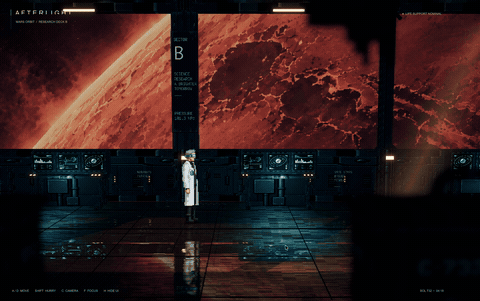

# Wombo - AI Game Studio 

Create named characters, animations, and sounds from text prompts. Generate aligned side, front and back references, then create walking, idle and transition animations with automatically saved PNG and Aseprite files. Image and video calls go through OpenRouter; Sound & SFX uses ElevenLabs directly from the server.

## Character creation

Describe your character and generate aligned side, front and back reference views.



## Animation creation

Turn your character into an animation, choose the frames to include, and save spritesheets as PNG and Aseprite files.



## Example game: After Light

**After Light** is a 2.5D interplanetary-cyberpunk game built using **Unity + Blender + Astra**, with sprite assets created in Wombo.



## Setup and run

Requires Node.js 20+ and `ffmpeg` on your PATH.

```bash
npm install
cp .env.example .env
```

In `.env`, set `OPENROUTER_API_KEY` for characters and animations, and `ELEVENLABS_API_KEY` for Sound & SFX. Each workflow only needs its own provider's key.

```bash
npm run dev
```

Open [localhost:5173](http://localhost:5173). Stop the app with `Ctrl+C`.

## Projects and storage

Choose **New Project** or **Open** on startup. Projects live outside the repository in `~/.ai-game-studio/`; set `AI_GAME_STUDIO_HOME` to use another location. Installation creates the storage directory.

```text
<project>/
├── .project               # Project manifest
├── sprites/<character>/   # References and animations/<animation>/
└── music/<sound>/         # Sound settings and audio revisions
```

Generated assets save automatically. **Save project**, switching assets, and **Close project** persist drafts. Each asset's JSON manifest points to its current files; older generated revisions are retained.

## Guides

- [Create sprites and animations](docs/create-sprites-and-animations.md)
- [Create music and SFX](docs/create-music-and-sfx.md)
- [AGENTS.md](AGENTS.md) — architecture, implementation rules, and testing.
