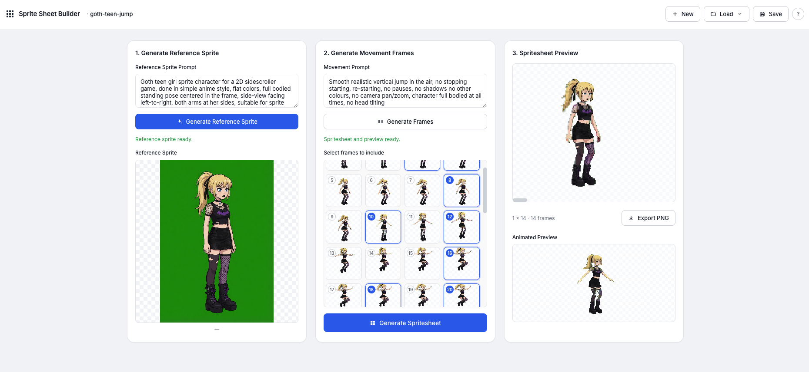

# AI Game Studio

A small local web app for generating 2D game sprites and animation frames from text prompts using xAI / Grok Imagine. Generate a reference sprite → describe motion → get extracted PNG frames → compose a 1×N spritesheet with a looping animated preview.

Backgrounds are chroma-keyed to transparency automatically, so frames drop straight into a game engine. Projects can be saved and loaded by name.



Full Demo: https://www.youtube.com/watch?v=MijheSPXnDo

## Requirements

- Node 20+
- `ffmpeg` on `PATH`
- An [xAI API key](https://x.ai)

## Install

```bash
git clone <this-repo>
cd ai-game-studio
npm install

cp .env.example .env
# then open .env and paste your key:
# XAI_API_KEY=xai-...
```

## Run

```bash
npm run dev
```

Open http://localhost:5173.

This starts Vite (frontend, :5173) and an Express server (backend, :8787) together. Stop with `Ctrl+C`.

## Using it

1. Type a sprite prompt in column 1 → **Generate Reference Sprite**.
2. Type a motion prompt in column 2 → **Generate Frames** (calls image-to-video, extracts transparent PNGs).
3. Click frame tiles to toggle which ones to include.
4. **Generate Spritesheet** → composes a 1×N PNG client-side, builds a looping GIF preview server-side.
5. **Export PNG** to download the spritesheet.
6. Header: **New** to start fresh, **Save** to name and snapshot the current project, **Load** to switch to a saved one.

Generated artifacts live under `projects/` (gitignored). The current working state is always in `projects/latest/`.

## Example prompts

### Sprite prompts

- `A pixel-art knight in silver armor with a longsword, side-view, full body, simple flat colors, standing pose`
- `Female ninja with red scarf, dynamic side-view, 2D sprite, anime style`
- `Cute green slime monster, side-view, big eyes, soft shading`
- `Cyberpunk hacker in a hoodie, glowing visor, side-view full body, gritty style`

### Motion prompts

- `Smooth walk cycle, side-view, no head tilting, no camera movement`
- `Sword slash attack, side-view, fast, no shadows`
- `Idle breathing animation, subtle, looping`
- `Jump arc — crouch, leap, mid-air, land`

Tips:
- Keep motion prompts focused on the action. Phrases like *"no camera movement"*, *"side-view"*, and *"no head tilting"* help keep frames game-ready.
- Default video duration is 2 seconds, ~30 fps → ~60 frames. Trim with the frame selector before composing.

## TO-DO

- [ ] Background generation
- [ ] Tilemap generation
- [ ] Aseprite format export
- [ ] Tiled format export
- [ ] SFX generation
- [ ] Music generation
- [ ] Voice generation
- [ ] Full asset scaffolding export

## More

See [AGENTS.md](AGENTS.md) for the full spec, architecture, endpoint list, and chroma-key tuning notes.
